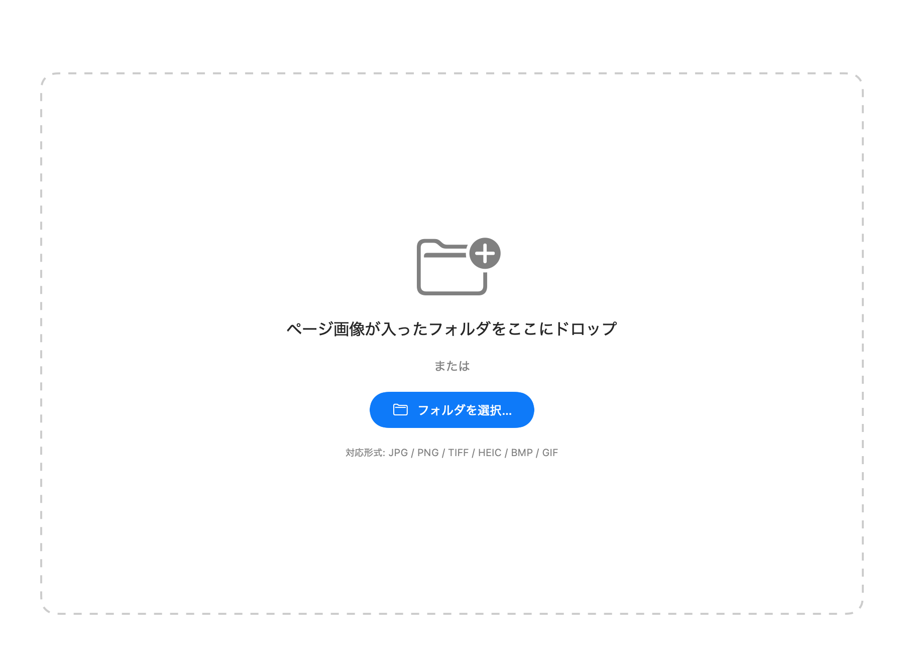
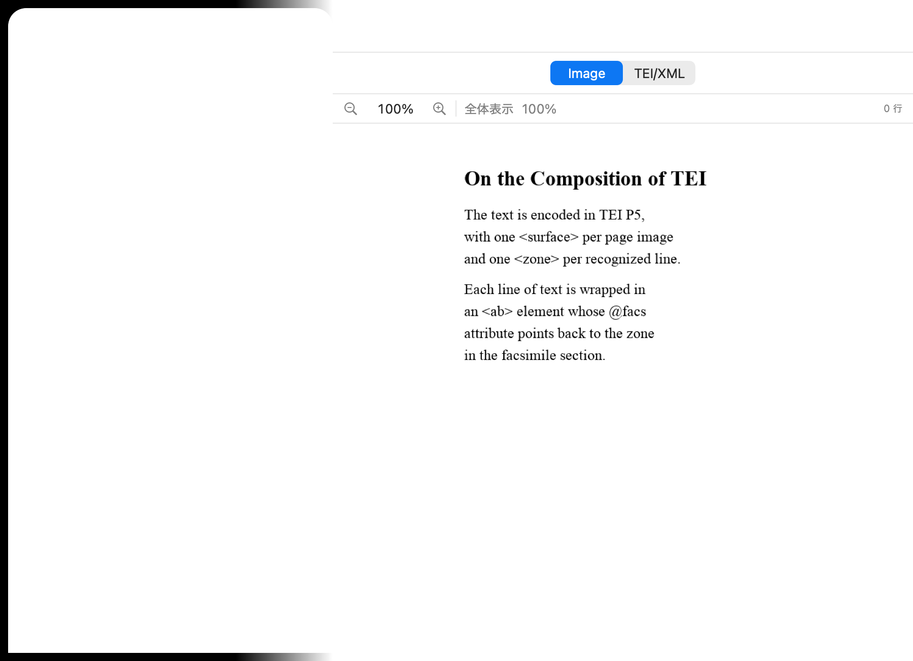
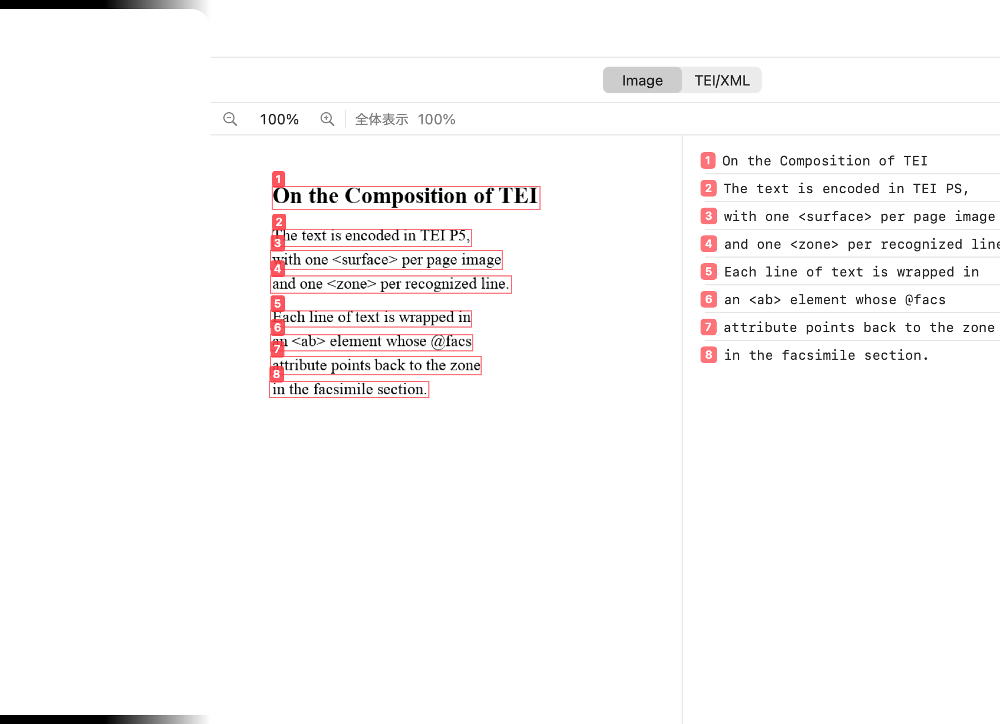
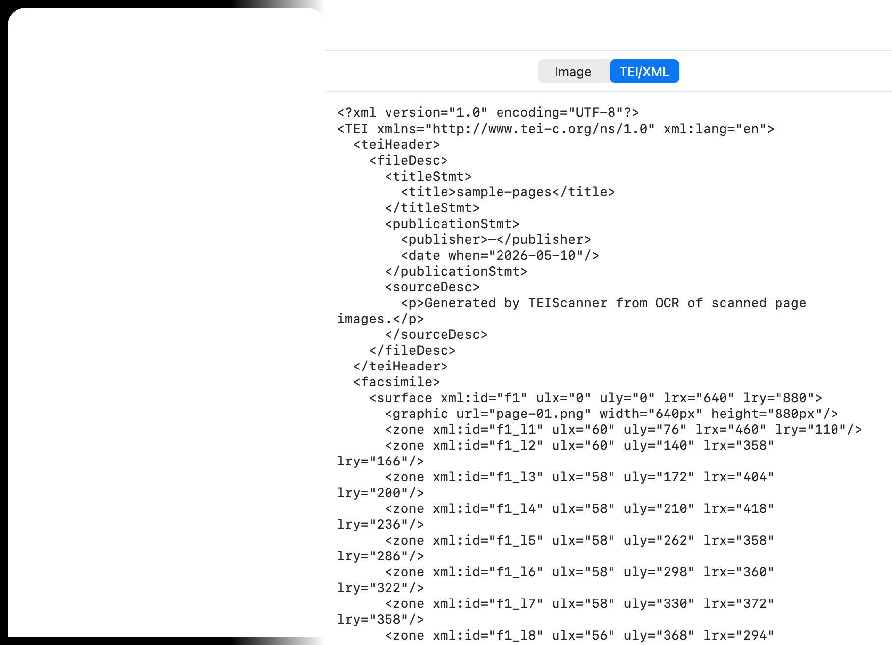

# TEI Scanner

スキャンした版面画像のフォルダを Apple Vision OCR にかけ、各行のバウンディングボックスを `<facsimile>` / `<zone>` として保持した 1 つの TEI/XML を生成する macOS デスクトップアプリです。

A macOS desktop app that runs Apple Vision OCR over a folder of page images and emits a single TEI/XML document with per-line `<facsimile>` / `<zone>` zones.

## スクリーンショット / Screenshots

| 起動直後 / Empty state | フォルダ読込後 / Folder loaded |
|---|---|
|  |  |

| OCR 完了 / OCR done | TEI/XML 表示 / TEI/XML view |
|---|---|
|  |  |

スクリーンショットは `scripts/capture_screenshots.sh` で自動生成しています。
Screenshots are generated automatically by `scripts/capture_screenshots.sh`.

## ダウンロード / Download

[Releases](../../releases) から最新の `.dmg` を取得し、ダブルクリックでマウント → `TEIScanner.app` を `/Applications` にドラッグしてください。

Get the latest `.dmg` from [Releases](../../releases). Double-click to mount, then drag `TEIScanner.app` into `/Applications`.

> Apple による Notarization 済みのため、初回起動で「開発元未確認」警告は出ません。  
> Notarized by Apple — no "unidentified developer" prompt on first launch.

## 機能 / Features

- フォルダ単位で複数画像を一括 OCR / Batch OCR over a folder of images
- 認識した行を bbox オーバーレイと連動するテキスト一覧として並列表示 / Side-by-side image preview with bbox overlay and a synced line list
- 拡大縮小・パン / Zoom and pan in the image preview
- 1 ページ = 1 `<surface>`、1 行 = 1 `<zone>` + `<ab facs="#…">` の TEI/XML 出力 / TEI/XML output: one `<surface>` per page, one `<zone>` + `<ab>` per line
- 言語切り替え：自動判別 / English / 日本語 / 中文 / 한국어 / Français / Deutsch / Español / Language picker covering the same set
- UI ローカライズ：日本語（既定）/ 英語 / Bilingual UI (Japanese default / English)

## ビルド / Build

```bash
brew install xcodegen
git clone https://github.com/nakamura196/tei-scanner.git
cd tei-scanner
xcodegen generate
open TEIScanner.xcodeproj
```

開発時は `swift run` でも軽量に立ち上がります（ローカライズは Xcode ビルド時のみ反映されます）。

For lightweight iteration, `swift run` works as well. Note that localized strings are only bundled when building via Xcode.

## 配布 / Release pipeline

```bash
# Developer ID + notarized .dmg
scripts/archive.sh --devid

# Mac App Store .pkg
scripts/archive.sh --appstore
```

`.env` に App Store Connect API キー、Bundle ID、Team ID 等を記載します（`.env.example` 参照）。

See `.env.example` for the required environment variables (App Store Connect API key, Bundle ID, Team ID, etc.).

## ライセンス / License

MIT License. See [LICENSE](LICENSE).
